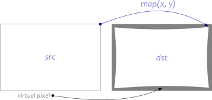
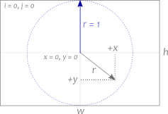
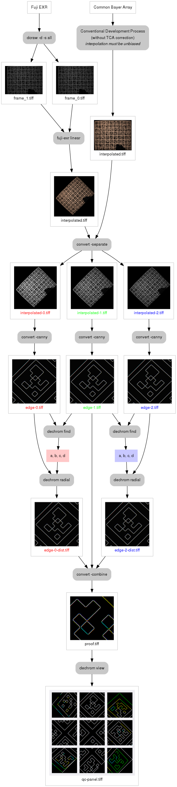

#dechrom

_A suite of tools for correcting chromatic aberration in TIFF images_

It is packaged in a single binary with the following subcommands:

* **`find`** &nbsp;&nbsp; A Nelder-Mead solver
* **`survey`** Samples the TCA error function in a volume of parameter space
* **`plot`** &nbsp;&nbsp;&nbsp; Generates an R program to plot survey data, solution, and simplex traces
* **`radial`** Applies a radial distortion transformation to a TIFF image
* **`view`** &nbsp;&nbsp;&nbsp; Helps examine channel convergence by clipping a panel of critical patches from an image

## Installation

* Run `make` (there will be dependencies)
* Move the binary somewhere in `$PATH`

## Motivation

These tools were built to support the decoding of Fuji EXR data. They can be
used with images from other sources, in which case they are probably redundant
with **Hugin**, **PanoTools**, or **PTLens** (although I hope more convenient
in some ways). But for developing the EXR images, there is no usable
substitute. Here is the list of reasons why a separate lens correction tool had
to be developed for the EXR:

* Fuji makes interesting cameras.
* But [Fuji's software](https://silkypix.isl.co.jp/en/) is proprietary, GUI-only, Windows/Mac-only, and is not too good. Its beauty is not commensurate with its performance.
* Common tools are unable to interpret high-resolution data from the EXR sensor because of its [unusual geometry](doc/images/fuji-cfm.png).
* Unusually high noise with unpleasant statistical properties coupled with strong chromatic aberration defeat many debayering algorithms.
* Consequently, no common lens correction tool can work with this lens/sensor combination, and this problem is circular.

**Solution**: deal with chromatic aberration head-on, then worry about proper debayering.

## Prior Art

* [*Correcting Chromatic Aberrations with Hugin and PanoTools*](http://hugin.sourceforge.net/tutorials/tca/en.shtml), by Pablo d'Angelo and Bruno Postle
* [*Chromatic Aberration Recovery on Arbitrary Images*](http://www.cs.bris.ac.uk/Publications/Papers/2001510.pdf), a PhD thesis by Daniel Blueman

The solution was inspired by the latter thesis, even though like all prior
solutions, it didn't quite work as described for Fuji. But it was a great
starting point. Daniel's idea was that there must be enough information in an
arbitrary image to reconstruct the transformations of the red and blue channels
bringing them into alignment with the green channel. In reality (at least in
that part of it which pertains to Fuji EXR), arbitrary images are so noisy that
the recovery of distortion coefficients by automatic optimization is far from
robust. But I have achieved some success with an altered version of Daniel's
method applied to the images of calibration targets.

## Lens Distortion Model and Image Remapping

The subtools that do lens distortion (`find`, `survey`, and `radial`) all apply
the same transformation to the input image. Expressed in the most general form,
this transformation locates, for each point in the destination image, the
corresponding point in the source image:

&nbsp;&nbsp;  *dst*(*x*, *y*) = *src*(*mapx*(*x*, *y*), *mapy*(*x*, *y*))

Points in the destination image that map outside the source image (_virtual
pixels_) are set to black. The digital version of this map is computed as
follows:

&nbsp;&nbsp;  *x* = (*2* · (*i* + *0.5*) - *w*) / *h*  
&nbsp;&nbsp;  *y* = (*2* · (*j* + *0.5*) - *h*) / *h*  
&nbsp;&nbsp;  *r* = √(*x*² + *y*²)  
&nbsp;&nbsp;  *rdistorted* = ***a*** · *r* + ***b*** · *r*² + ***c*** · *r*³ +  ***d*** · *r*⁴  
&nbsp;&nbsp;  *mapx*[*j*, *i*] = *0.5* · (*h* · *x* · *rdistorted* / *r* + *w*) - *shiftx*  
&nbsp;&nbsp;  *mapy*[*j*, *i*] = *0.5* · (*h* · *y* · *rdistorted* / *r* + *h*) - *shifty*

where *i* and *j* are the *x*- and *y*-indices of the destination image, *w* and *h* are the width and height of both images, and (***a***, ***b***, ***c***, ***d***) are the radial distortion coefficients we seek to recover. Co-ordinates *x* and *y* are centered and normalized to the shorter dimension (*h* in landscape orientation):

Because the radial distortion model does not perfectly fit all real-world cases of chromatic aberration, parameters *shiftx* and *shifty* can be used as additional tweaks, but they are not optimized automatically.

## Coefficient recovery workflow

### 0. Shoot a suitable target

### 1. Toss a coin

This workflow will take you from a raw image to a first guesstimate of distortion coefficients.

