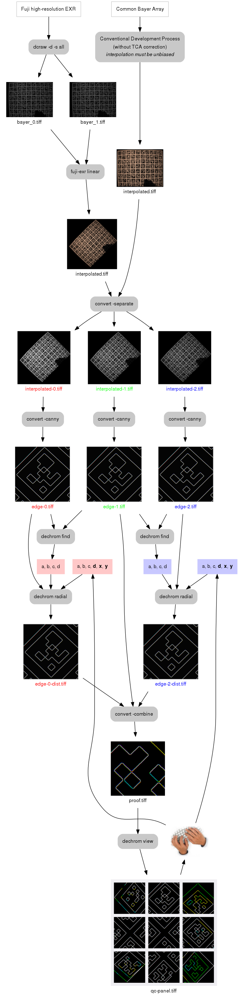

#dechrom

_A multi-tool for correcting chromatic aberration in TIFF images_


It is packaged in a single binary with the following subcommands:

* **`find`** &nbsp;&nbsp; A Nelder-Mead solver
* **`survey`** Samples the TCA error function in a volume of parameter space
* **`plot`** &nbsp;&nbsp;&nbsp; Generates an R program to plot survey data, solution, and simplex traces
* **`radial`** Applies a radial distortion transformation to a TIFF image
* **`view`** &nbsp;&nbsp;&nbsp; Helps examine channel convergence by clipping a panel of critical patches from an image

## Installation


* Run `make` (there will be dependencies)
* Move the binary somewhere in `$PATH`

## Pixel-level result sample


The image on the left is produced by detecting edges in a crude linear interpolation of the raw EXR photograph. On the right, the corrected version of the same image. Distortion coefficients were obtained from the raw image by minimizing inter-channel differences.


## Motivation

These tools were built to support the decoding of Fuji EXR data. They can be
used with images from other sources, in which case they are probably redundant
with **Hugin**, **PanoTools**, or **PTLens** (although I hope more convenient
in some ways). But for developing the EXR images, there is no usable
substitute. Here is the list of reasons why a separate lens correction tool had
to be developed for the EXR:


* Fuji makes interesting cameras.
* But [Fuji's software](https://silkypix.isl.co.jp/en/) is proprietary, GUI-only, Windows/Mac-only, and is not too good. Its beauty is not commensurate with its performance.
* Common tools are unable to interpret high-resolution data from the EXR sensor because of its [unusual geometry](doc/images/fuji-cfm.png).
* Unusually high noise with unpleasant statistical properties coupled with strong chromatic aberration defeat many debayering algorithms.
* Consequently, no common lens correction tool can work with this lens/sensor combination, and this problem is circular.

**Solution**: deal with chromatic aberration head-on, then worry about [proper debayering](https://github.com/selkovjr/fuji-exr).

## Prior art

* [*Correcting Chromatic Aberrations with Hugin and PanoTools*](http://hugin.sourceforge.net/tutorials/tca/en.shtml), by Pablo d'Angelo and Bruno Postle
* [*Chromatic Aberration Recovery on Arbitrary Images*](http://www.cs.bris.ac.uk/Publications/Papers/2001510.pdf), a PhD thesis by Daniel Blueman

The solution was inspired by the latter thesis, even though like all prior
solutions, it didn't quite work as described for Fuji. But it was a great
starting point. Daniel's idea was that there must be enough information in an
arbitrary image to reconstruct the transformations of the red and blue channels
bringing them into alignment with the green channel. In reality (at least in
that part of it which pertains to Fuji EXR), arbitrary images are so noisy that
the recovery of distortion coefficients by automatic optimization is far from
robust. But I have achieved some success with an altered version of Daniel's
method applied to the images of calibration targets.

## Lens distortion model and image remapping

The subtools that do lens distortion (`find`, `survey`, and `radial`) all apply
the same transformation to the input image. Expressed in the most general form,
this transformation locates, for each point in the destination image, the
corresponding point in the source image:

&nbsp;&nbsp;  *dst*(*x*, *y*) = *src*(*map<sub>x</sub>*(*x*, *y*), *map<sub>y</sub>*(*x*, *y*))


Points in the destination image that map outside the source image (_virtual
pixels_) are set to black. The digital version of this map is computed as
follows:

&nbsp;&nbsp;  *x* = (*2* · (*i* + *0.5*) - *w*) / *h* <br>
&nbsp;&nbsp;  *y* = (*2* · (*j* + *0.5*) - *h*) / *h* <br>
&nbsp;&nbsp;  *r* = √(*x*² + *y*²) <br>
&nbsp;&nbsp;  *r<sub>distorted</sub>* = ***a*** · *r* + ***b*** · *r*² + ***c*** · *r*³ +  ***d*** · *r*⁴ <br>
&nbsp;&nbsp;  *map<sub>x</sub>*[*j*, *i*] = *0.5* · (*h* · *x* · *r<sub>distorted</sub>* / *r* + *w*) - *shift<sub>x</sub>* <br>
&nbsp;&nbsp;  *map<sub>y</sub>*[*j*, *i*] = *0.5* · (*h* · *y* · *r<sub>distorted</sub>* / *r* + *h*) - *shift<sub>y</sub>*

where *i* and *j* are the *x*- and *y*-indices of the destination image, *w* and *h* are the width and height of both images, and (***a***, ***b***, ***c***, ***d***) are the radial distortion coefficients we seek to recover. Co-ordinates *x* and *y* are centered and normalized to the shorter dimension (*h* in landscape orientation):


Because the radial distortion model does not perfectly fit all real-world cases
of chromatic aberration, parameters *shift<sub>x</sub>* and *shift<sub>y</sub>*
can be used as additional tweaks, but they are not optimized automatically.


## Coefficient recovery workflow

### 0. Shoot a suitable target

I use a printed calibration target mounted on a tripod like so:


The small size of a target like this is believed to present problems at wide
angles due to the proximity of the lens and the associated parallax. At my
camera's widest setting, I had to shoot this 1m-wide target from about 70
centimeters in order to fill the frame. Lens calibration experts recommend the
minimal object distance on the order of 10 meters. I interpret this
recommendation as applicable to full-size sensors and lenses used by the
experts, and I have found no indications of parallax in the images of this
target made with Fuji HS50EXR, whose sensor (6.4 × 4.8 mm) must be one of the
smallest to be found in any camera. If the problem exists, it is likely of
smaller magnitude than the chromatic aberration problem we're solving.

At any rate, what really matters is that the scene used for calibration is
populated by prominent high-contrast features that cannot be easily overcome
with noise. The target I use satisfies this requirement, but many other
types, such as building façades, will also work.


### 1. Toss a coin

This workflow will take you from a raw image to a first guesstimate of
distortion coefficients. It is essentially the same workflow Daniel Blueman
describes in his thesis, except in this instance, we use edge-detected
derivatives of the calibration image instead of histogram-equalized ones, and,
against Daniel's recommendation, the Nelder-Mead solver is used instead of
L-BFGS-B &mdash; for the simple technical reason that I was unable to get BFGS
going.

The following diagram shows two entry points: one for the EXR data, and another
one for conventional Bayer. The EXR array is composed of two interlaced Bayer
arrays. They are interlaced in such a way that their combination can only be
mapped to a rectangular grid if they are tilted 45°. The `dechrom` tool suite
works equally well with both kinds of images; the only difference is the
EXR-specific optimization whereby the black mask surrounding the tilted array
is excluded from processing. Also, a Fuji-specific tool from another tool suite
([fuji-exr linear](https://github.com/selkovjr/fuji-exr)) is needed to produce
the first linear interpolation of the EXR image.

In either case, use a simple linear interpolation. Avoid AHD, bicubic, or any
sophisticated interpolation method. They are all based on the assumption that
color planes are aligned.



At the end of this workflow, a lattice of central and peripheral patches from
the proof image is composed as a quality control aid. The goal is to make the
edges appear as white as possible at the pixel level, and to make sure that any
remaining color fringing does not show consistent directional bias across the
image. Interpolation artifacts and aliasing in edge detection will always
result in scattered colored spots and line segments, but such defects must not
be continuous and they must not occur on the same side everywhere. The
following two samples illustrate the unbiased and biased patterns:

 

Small biases can be compensated by tweaking distortion coefficients (starting
with the ***d***, as it has the highest power) or by shifting the entire color
plane (parameters ***x*** and ***y*** in `radial`). For example, if the red
color plane is in a perfect match in one corner but appears to be too large in
the opposite corner, with the defect varying proportionally in between, such
result may indicate an axial tilt. The radial TCA model is unable to correct such
aberration, but it can be somewhat compensated by reducing the overall expansion
for this plane and shifting it at the same time.


## 2. Repeat

Test the same procedure on several images shot with the same focal distance
under different conditions: different exposure, different angles, &c. Avoid
over-fitting at this stage. Edge-detected images or other derivatives used
to estimate the TCA may not be accurate representations of raw data; use them as
rough guides.


## 3. If you are lucky

If all went well and simple optimization of a few target images has delivered a
workable set of distortion parameters, stash them in a database indexed by
focal distance and whatever else you think might be a factor. Maybe you will
discover that temperature or elevation above sea level are significant factors.
Maybe one of your factors will be a boolean named `before/after I dropped the
camera`.

The next time you encounter an image matching this database entry, the same
core workflow you used to discover the distortion parameters can be applied to
it (sans optimization):

```Pony
#Fuji HS50EXR HR mode @4.4mm
#!/bin/bash
path=${1%.RAF}
dcraw -d -s all -4 -T $path.RAF
fuji-exr linear -x ${path}_[01]* interpolated.tiff
convert interpolated.tiff -separate interpolated-%d.tiff
dechrom radial -f -x-0.5 -y-1 0.999554 0.001957 0.002131 -0.0033 interpolated-0.tiff interpolated-dist-0.tiff
dechrom radial -f             0.999098 0.001327 0.002287 -0.0025 interpolated-2.tiff interpolated-dist-2.tiff
fuji-exr ssdd -x 3264x2464 interpolated-dist-0.tiff interpolated-1.tiff interpolated-dist-2.tiff $path.tiff

```
What happens here:

1. The raw image is extracted with `dcraw` in document mode (`-d`) and all two
of its subframes (`-s all`) are saved as 16-bit linear (`-4`) TIFFs
(`-T`). The subframes are labeled `_0` and `_1`, and each contains a regular
BGGR Bayer array.

2. The [`fuji-exr linear`](https://github.com/selkovjr/fuji-exr) tool rotates
and interlaces these subrframes, reconstructing the Fuji EXR array. Then it
does a first-order linear interpolation within each subframe, pretending the
other subframe does not exist. Doing so leads to a loss of spatial resolution
in the green and red color planes, but at this point, preserving unbiased
inter-channel registration is more important, and symmetric linear
interpolation is the only way to do it.

3. ImageMagick's
[`convert`](http://www.imagemagick.org/Usage/color_basics/#separate) splits the
interpolated raw image into separate color planes, labeling them with `-0` for
red, `-1` for green, and `-2` for blue. These suffixes are generated by the
by the `%d` macro in the output argument.

4. The distortion coefficients discovered by optimization (or otherwise) are
used to remap the red and blue planes with `dechrom radial`. In this example,
the red plane is translated by a small amount. At this stage, the only
remaining raw data reside in one half of the green channel that has not been
interpolated. All red and blue pixels have been spread and shifted around.

5. However, the resulting color planes still have the same arrangement as the
original EXR array. They are further processed as a surrogate raw image by the
self-similarity-driven debayering tool [`fuji-exr ssdd`]() implementing the
[SSDD algorithm by Buades et
al.](https://hal-descartes.archives-ouvertes.fr/hal-00449362/document)

The following set of images demonstrates the stages of this process. The sample
on the left represents raw data after linear interpolation. The middle sample
is the TCA-corrected version of interpolated raw data. At this point, this project's
lens-correction job is done (perhaps not perfectly, but reasonably well).
However, the whole point of doing it was to enable proper debayering, which can
now be accomplished in a number of ways. SSDD is one such method, and
its output is shown on the right. Note how it fixes the zipper artifact in the
deep shadow above the latch handle, and how it removes some of the chroma
noise without degrading the level of detail.


## 4. When things go wrong
